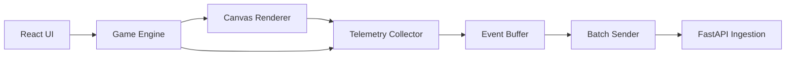
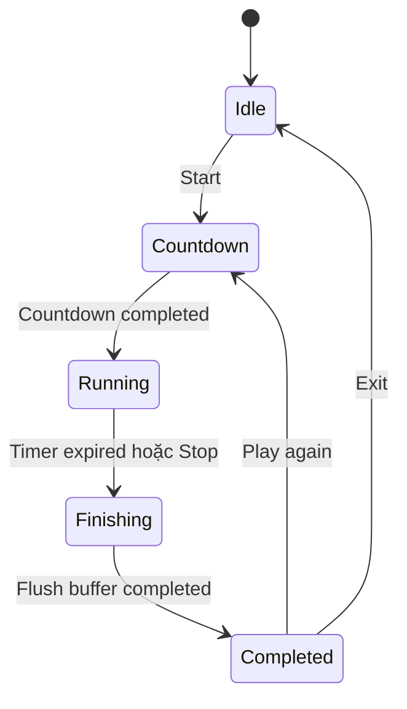
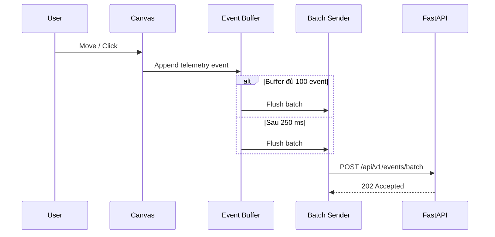
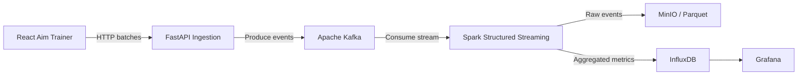

# Ứng dụng web Aim Trainer
## Ý tưởng, thiết kế chức năng và kiến trúc triển khai

> Tài liệu đặc tả cho ứng dụng Aim Trainer đóng vai trò nguồn sinh dữ liệu trong đồ án môn học Big Data: **Real-time Mouse Tracking Pipeline**.

---

## 1. Tổng quan

Aim Trainer là một ứng dụng web đơn giản yêu cầu người dùng di chuyển chuột và nhấp vào các mục tiêu xuất hiện ngẫu nhiên trên màn hình trong một khoảng thời gian cố định.

Ứng dụng có hai vai trò:

1. **Vai trò sản phẩm:** cung cấp một trò chơi luyện phản xạ chuột có thể sử dụng trực tiếp trên trình duyệt.
2. **Vai trò dữ liệu:** phát sinh luồng telemetry gồm chuyển động chuột, click, hit/miss và thông tin phiên chơi để gửi vào hệ thống Big Data.

Trong đồ án này, Aim Trainer không phải trọng tâm độc lập. Nó là **nguồn sinh dữ liệu có ngữ cảnh rõ ràng**, giúp chứng minh toàn bộ pipeline:

```text
Aim Trainer
    → FastAPI Ingestion
    → Apache Kafka
    → Spark Structured Streaming
    → MinIO / InfluxDB
    → Grafana và Session Analytics
```

---

## 2. Mục tiêu

### 2.1. Mục tiêu chức năng

Ứng dụng cần cho phép người dùng:

- Bắt đầu một phiên Aim Trainer.
- Chọn thời lượng phiên chơi.
- Di chuyển chuột và click vào mục tiêu.
- Xem score, accuracy và thời gian còn lại.
- Xem kết quả sau khi kết thúc phiên.
- Theo dõi trạng thái gửi dữ liệu telemetry.
- Xem phân tích cơ bản của phiên đã chơi.

### 2.2. Mục tiêu kỹ thuật

Ứng dụng cần:

- Thu thập được sự kiện `mousemove` và `click`.
- Không gửi một HTTP request cho từng sự kiện.
- Gom sự kiện thành batch trước khi gửi.
- Không gây re-render React cho mỗi lần chuột di chuyển.
- Có khả năng tiếp tục gom dữ liệu khi backend phản hồi chậm.
- Có cấu trúc mã nguồn tách biệt giữa gameplay, giao diện và telemetry.
- Có thể chạy độc lập ở local bằng Docker hoặc Vite development server.

### 2.3. Mục tiêu demo Big Data

Ứng dụng phải giúp người chấm quan sát được:

- Dữ liệu đang được sinh liên tục.
- Dữ liệu được gom batch trước khi truyền.
- Một phiên chơi có thể tạo hàng nghìn sự kiện.
- Kết quả cuối cùng được xử lý bất đồng bộ qua Kafka và Spark.
- Dữ liệu raw và dữ liệu tổng hợp được lưu ở hai nơi khác nhau.

---

## 3. Phạm vi thực tế cho đồ án môn học

### 3.1. Phạm vi bắt buộc

Phiên bản MVP nên có:

- Một chế độ chơi duy nhất.
- Mục tiêu hình tròn.
- Thời lượng 30 hoặc 60 giây.
- Score và accuracy.
- Thu thập `mousemove` và `click`.
- Telemetry batching.
- Hiển thị trạng thái kết nối.
- Trang kết quả phiên.
- Heatmap hoặc mouse trajectory ở mức cơ bản.
- Tích hợp với FastAPI ingestion API.

### 3.2. Không nằm trong phạm vi chính

Không cần triển khai:

- Đăng nhập và phân quyền.
- Hồ sơ người dùng.
- Xếp hạng trực tuyến.
- Multiplayer.
- Anti-cheat.
- Responsive đầy đủ cho điện thoại.
- Nhiều chế độ game.
- Replay video hoàn chỉnh.
- AI phát hiện bot.
- Elasticsearch.
- Gradio.

Các phần trên có thể được ghi ở mục hướng phát triển, nhưng không nên làm phình phạm vi đồ án.

---

## 4. Luồng sử dụng chính

### 4.1. Luồng bắt đầu phiên chơi

1. Người dùng mở trang `/play`.
2. Chọn thời lượng: 30 hoặc 60 giây.
3. Nhấn **Start**.
4. Ứng dụng đếm ngược `3 → 2 → 1`.
5. Một `sessionId` được tạo.
6. Metadata phiên được gửi tới backend.
7. Game bắt đầu sinh mục tiêu và thu thập telemetry.

### 4.2. Luồng trong khi chơi

1. Người dùng di chuyển chuột.
2. Ứng dụng ghi sự kiện vào bộ đệm cục bộ.
3. Người dùng click:
   - Trúng mục tiêu: tăng score và sinh mục tiêu mới.
   - Trượt mục tiêu: tăng miss.
4. Mỗi 250 ms, hoặc khi buffer đủ 100 sự kiện, dữ liệu được gửi thành batch.
5. Giao diện cập nhật:
   - Thời gian còn lại.
   - Score.
   - Accuracy.
   - Số event đã sinh.
   - Số batch đã gửi.
   - Trạng thái kết nối.

### 4.3. Luồng kết thúc phiên

1. Timer về 0.
2. Game dừng thu thập sự kiện.
3. Buffer còn lại được gửi hết.
4. Một sự kiện `session_end` được gửi.
5. Ứng dụng hiển thị kết quả tạm thời từ frontend.
6. Backend xử lý bất đồng bộ qua Kafka và Spark.
7. Khi metrics đã sẵn sàng, giao diện hiển thị kết quả chính thức.

---

## 5. Thiết kế trang web

Ứng dụng gồm bốn màn hình chính:

```text
/                    Trang giới thiệu
/play                Aim Trainer
/result/:sessionId   Kết quả phiên
/dashboard           Dashboard và danh sách phiên
```

---

## 6. Trang giới thiệu

### 6.1. Mục đích

Trang giới thiệu cần giải thích ngắn gọn:

- Ứng dụng làm gì.
- Dữ liệu nào được thu thập.
- Pipeline phía sau sử dụng công nghệ nào.
- Cách bắt đầu phiên chơi.

### 6.2. Bố cục đề xuất

```text
┌─────────────────────────────────────────────────────────┐
│ MouseStream                              Play | Dashboard │
├─────────────────────────────────────────────────────────┤
│                                                         │
│          Real-time Mouse Telemetry Analytics             │
│                                                         │
│  Aim Trainer tạo dữ liệu chuyển động chuột và gửi qua    │
│  Kafka – Spark để xử lý theo thời gian thực.             │
│                                                         │
│               [ Bắt đầu Aim Trainer ]                    │
│                                                         │
├─────────────────────────────────────────────────────────┤
│ React → FastAPI → Kafka → Spark → InfluxDB / MinIO       │
└─────────────────────────────────────────────────────────┘
```

---

## 7. Trang Aim Trainer

### 7.1. Bố cục

```text
┌──────────────────────────────────────────────────────────┐
│ Time: 00:24   Score: 18   Accuracy: 81%   Stream: ● Live │
├───────────────────────────────────────────┬──────────────┤
│                                           │ Session Info │
│                                           │              │
│             AIM TRAINER CANVAS            │ Events: 4820 │
│                                           │ Batches: 41  │
│                    ●                      │ Avg speed    │
│                                           │ 738 px/s     │
│                                           │              │
│                                           │ [Stop]       │
├───────────────────────────────────────────┴──────────────┤
│ Pipeline: Connected | Last batch: 120 events             │
└──────────────────────────────────────────────────────────┘
```

### 7.2. Thành phần giao diện

#### Thanh trạng thái trên

Hiển thị:

- Thời gian còn lại.
- Score.
- Accuracy.
- Trạng thái stream.

#### Canvas chơi

Canvas là khu vực chính để:

- Vẽ mục tiêu.
- Ghi nhận tọa độ chuột.
- Xác định hit hoặc miss.
- Giới hạn dữ liệu trong hệ tọa độ nhất quán.

#### Session panel

Hiển thị:

- `sessionId` rút gọn.
- Tổng event đã sinh.
- Tổng batch đã gửi.
- Kích thước batch gần nhất.
- Tốc độ chuột trung bình tạm thời.
- Trạng thái pipeline.

#### Nút điều khiển

- Start.
- Stop.
- Play Again.
- View Analytics.

---

## 8. Thiết kế gameplay

### 8.1. Mục tiêu

Mục tiêu được biểu diễn bởi:

```ts
type Target = {
  id: string;
  x: number;
  y: number;
  radius: number;
  createdAt: number;
};
```

### 8.2. Quy tắc sinh mục tiêu

- Mục tiêu nằm hoàn toàn trong canvas.
- Không sinh quá sát mép.
- Sau khi click trúng, mục tiêu cũ bị xóa.
- Mục tiêu mới được sinh tại vị trí ngẫu nhiên.
- Có thể giữ bán kính cố định trong phiên bản MVP.

### 8.3. Xác định hit

Một click được xem là hit nếu:

```text
distance(click, targetCenter) ≤ targetRadius
```

Trong đó:

```text
distance = sqrt((clickX - targetX)^2 + (clickY - targetY)^2)
```

### 8.4. Score

MVP có thể sử dụng:

```text
score = số lần click trúng mục tiêu
```

Không cần hệ thống điểm phức tạp theo khoảng cách hoặc tốc độ.

### 8.5. Accuracy

```text
accuracy = hitCount / totalClickCount × 100%
```

---

## 9. Kiến trúc frontend

### 9.1. Kiến trúc tổng thể

Frontend foundation sử dụng Vite React TypeScript với shadcn/ui và Tailwind CSS cho app shell, HUD, controls và các trang placeholder. shadcn không phải lớp render canvas và không được dùng để quản lý telemetry hot path.

API foundation sử dụng FastAPI chạy qua uv-managed Python 3.12.13. API request path chỉ validate/accept dữ liệu và chuyển tiếp sang downstream, không tính analytics nặng hoặc ghi raw telemetry đồng bộ xuống disk.



### 9.2. Nguyên tắc tách trách nhiệm

#### UI layer (lớp giao diện)

Phụ trách:

- Điều hướng trang.
- Hiển thị score, timer và trạng thái.
- Hiển thị kết quả phiên.

#### Game layer (lớp gameplay)

Phụ trách:

- Trạng thái game.
- Sinh mục tiêu.
- Xử lý hit/miss.
- Timer phiên.
- Kết thúc phiên.

#### Telemetry layer (lớp telemetry)

Phụ trách:

- Nhận sự kiện từ canvas.
- Chuẩn hóa event.
- Gắn `sessionId`, `eventId` và `sequence`.
- Gom batch.
- Retry khi gửi thất bại.
- Theo dõi số event và batch.

#### API layer (lớp giao tiếp API)

Phụ trách:

- Giao tiếp HTTP với backend.
- Không chứa logic gameplay.
- Không thao tác trực tiếp với canvas.

---

## 10. Quản lý trạng thái

### 10.1. Trạng thái phiên chơi

```ts
type GameStatus =
  | "idle"
  | "countdown"
  | "running"
  | "finishing"
  | "completed";
```

### 10.2. State machine



### 10.3. State nào nên dùng React state

Dùng React state cho:

- Score.
- Hit count.
- Miss count.
- Time remaining.
- Game status.
- Trạng thái kết nối.
- Thống kê hiển thị.

### 10.4. State nào nên dùng `useRef`

Dùng `useRef` cho:

- Event buffer.
- Sequence number.
- Canvas context.
- Mouse position hiện tại.
- Timer handle.
- Flush interval.
- Số liệu tạm thời cập nhật rất thường xuyên.

Lý do: `mousemove` có tần suất cao; cập nhật React state cho mọi event sẽ tạo re-render không cần thiết.

---

## 11. Thiết kế telemetry

### 11.1. Nguyên tắc

Mỗi event cần:

- Có định danh duy nhất.
- Thuộc về một phiên.
- Có thứ tự tương đối trong phiên.
- Có thời điểm phát sinh ở client.
- Có loại event rõ ràng.
- Có tọa độ tương đối theo canvas.

### 11.2. Mouse move event

```json
{
  "eventId": "8d8eab4e-...",
  "sessionId": "9243f3b4-...",
  "eventType": "mousemove",
  "eventTime": 1784498400123,
  "sequence": 1024,
  "x": 842,
  "y": 421
}
```

### 11.3. Click event

```json
{
  "eventId": "4b571558-...",
  "sessionId": "9243f3b4-...",
  "eventType": "click",
  "eventTime": 1784498400456,
  "sequence": 1025,
  "x": 845,
  "y": 425,
  "targetId": "target-18",
  "targetHit": true,
  "reactionTimeMs": 328
}
```

### 11.4. Session start event

```json
{
  "eventId": "162fe0da-...",
  "sessionId": "9243f3b4-...",
  "eventType": "session_start",
  "eventTime": 1784498400000,
  "sequence": 0,
  "durationSeconds": 60,
  "canvasWidth": 1200,
  "canvasHeight": 700,
  "viewportWidth": 1920,
  "viewportHeight": 1080,
  "devicePixelRatio": 1
}
```

### 11.5. Session end event

```json
{
  "eventId": "5ffc1758-...",
  "sessionId": "9243f3b4-...",
  "eventType": "session_end",
  "eventTime": 1784498460000,
  "sequence": 6218,
  "score": 42,
  "hitCount": 42,
  "missCount": 8,
  "totalEvents": 6218
}
```

---

## 12. Chuẩn hóa tọa độ

Không nên chỉ lưu tọa độ theo toàn màn hình.

Nên lưu tọa độ tương đối theo canvas:

```text
x = mouseClientX - canvasLeft
y = mouseClientY - canvasTop
```

Có thể bổ sung tọa độ chuẩn hóa:

```text
normalizedX = x / canvasWidth
normalizedY = y / canvasHeight
```

Tọa độ chuẩn hóa giúp so sánh các phiên có kích thước màn hình khác nhau.

Ví dụ:

```json
{
  "x": 600,
  "y": 350,
  "normalizedX": 0.5,
  "normalizedY": 0.5
}
```

---

## 13. Event batching

### 13.1. Lý do

Không gửi một request cho mỗi `mousemove` vì:

- Tạo quá nhiều HTTP request.
- Tăng overhead header và kết nối.
- Làm nghẽn ingestion API.
- Không phản ánh cách thu thập telemetry thực tế.

### 13.2. Chính sách batch

MVP sử dụng một trong hai điều kiện:

```text
Flush khi:
- đủ 100 event; hoặc
- đã qua 250 ms kể từ lần flush trước.
```

### 13.3. Batch payload

```json
{
  "sessionId": "9243f3b4-...",
  "sentAt": 1784498400500,
  "batchSequence": 12,
  "events": [
    {
      "eventId": "event-1",
      "eventType": "mousemove",
      "eventTime": 1784498400450,
      "sequence": 1021,
      "x": 820,
      "y": 410
    },
    {
      "eventId": "event-2",
      "eventType": "click",
      "eventTime": 1784498400456,
      "sequence": 1022,
      "x": 845,
      "y": 425,
      "targetHit": true
    }
  ]
}
```

### 13.4. Cơ chế gửi



---

## 14. Retry và mất kết nối

### 14.1. Trạng thái stream

```ts
type StreamStatus =
  | "idle"
  | "connected"
  | "buffering"
  | "offline"
  | "error";
```

### 14.2. Hành vi khi gửi lỗi

- Không xóa batch khỏi hàng đợi trước khi nhận phản hồi thành công.
- Retry tối đa 3 lần.
- Dùng exponential backoff đơn giản:
  - 500 ms.
  - 1 giây.
  - 2 giây.
- Nếu vẫn lỗi:
  - Chuyển trạng thái sang `offline`.
  - Giữ batch trong memory trong phạm vi giới hạn.
  - Hiển thị cảnh báo.
- Không cần triển khai lưu IndexedDB trong MVP.

### 14.3. Giới hạn bộ nhớ

Để tránh buffer tăng vô hạn:

```text
MAX_BUFFERED_EVENTS = 20.000
```

Nếu vượt giới hạn:

- Ưu tiên giữ click event.
- Có thể giảm tần suất lưu mousemove.
- Ghi nhận `droppedEventCount`.

---

## 15. Giảm tần suất mousemove

Trình duyệt có thể phát rất nhiều `mousemove` event. MVP có thể áp dụng sampling đơn giản:

```text
Chỉ ghi một mousemove event mỗi 16 ms.
```

Tương đương tối đa khoảng 60 mẫu/giây cho mỗi người dùng.

Điều này:

- Giảm tải frontend.
- Giảm kích thước dữ liệu.
- Vẫn đủ để vẽ trajectory và tính vận tốc.
- Dễ kiểm soát khi demo.

Nếu muốn tạo tải lớn cho pipeline, nên dùng load generator riêng thay vì tăng vô hạn tần suất của một người chơi thật.

---

## 16. Contract API

### 16.1. Khởi tạo phiên

```http
POST /api/v1/sessions
Content-Type: application/json
```

Request:

```json
{
  "sessionId": "9243f3b4-...",
  "startedAt": 1784498400000,
  "durationSeconds": 60,
  "canvasWidth": 1200,
  "canvasHeight": 700,
  "viewportWidth": 1920,
  "viewportHeight": 1080
}
```

Response:

```json
{
  "accepted": true,
  "sessionId": "9243f3b4-..."
}
```

### 16.2. Gửi batch telemetry

```http
POST /api/v1/events/batch
Content-Type: application/json
```

Response phù hợp:

```http
202 Accepted
```

```json
{
  "accepted": true,
  "batchSequence": 12,
  "eventCount": 84
}
```

### 16.3. Kết thúc phiên

```http
POST /api/v1/sessions/{sessionId}/complete
```

### 16.4. Lấy metrics phiên

```http
GET /api/v1/sessions/{sessionId}/metrics
```

Khi chưa xử lý xong:

```json
{
  "status": "processing"
}
```

Khi đã có kết quả:

```json
{
  "status": "completed",
  "sessionId": "9243f3b4-...",
  "score": 42,
  "accuracy": 84,
  "averageReactionTimeMs": 328,
  "averageSpeedPxPerSecond": 736,
  "totalDistancePx": 12482,
  "totalEvents": 6218
}
```

---

## 17. Trang kết quả phiên

### 17.1. Bố cục

```text
┌─────────────────────────────────────────────────────────┐
│ Session completed                                       │
├─────────────────────┬───────────────────────────────────┤
│ Score               │ 42                                │
│ Accuracy            │ 84%                               │
│ Average reaction    │ 328 ms                            │
│ Mouse distance      │ 12,482 px                         │
│ Average speed       │ 736 px/s                          │
│ Events generated    │ 6,218                             │
│ Batches transmitted │ 53                                │
└─────────────────────┴───────────────────────────────────┘

             [View Analytics] [Play Again]
```

### 17.2. Hai lớp kết quả

#### Kết quả tạm thời

Tính trực tiếp tại frontend:

- Score.
- Hit.
- Miss.
- Accuracy.
- Số event.
- Số batch.

#### Kết quả xử lý

Từ Spark:

- Tổng quãng đường.
- Vận tốc trung bình.
- Click theo cửa sổ thời gian.
- Heatmap.
- Metrics session chính thức.

Giao diện nên hiển thị:

```text
Kafka: received
Spark: processing
Metrics: available
```

---

## 18. Dashboard phân tích

### 18.1. KPI

- Active sessions.
- Events per second.
- Total events.
- Average processing latency.

### 18.2. Biểu đồ

- Event throughput theo thời gian.
- Click throughput theo thời gian.
- Heatmap click.
- Danh sách session gần nhất.

### 18.3. Danh sách session

| Session | Duration | Events | Accuracy | Status |
|---|---:|---:|---:|---|
| `a8f2...` | 60 giây | 7.428 | 82% | Completed |
| `b91c...` | 30 giây | 3.182 | 76% | Completed |
| `d71e...` | 60 giây | 4.029 | — | Processing |

---

## 19. Session detail

Trang chi tiết phiên có thể gồm:

### 19.1. Mouse trajectory

Vẽ polyline qua các điểm `mousemove`.

### 19.2. Click heatmap

Dùng các click event để vẽ mật độ theo tọa độ.

### 19.3. Session metrics

- Score.
- Accuracy.
- Average reaction time.
- Average speed.
- Total mouse distance.
- Total event count.
- Hit/miss ratio.

Không cần replay hoạt ảnh đầy đủ trong MVP.

---

## 20. Cấu trúc thư mục frontend

```text
frontend/
├── public/
├── src/
│   ├── app/
│   │   ├── App.tsx
│   │   ├── router.tsx
│   │   └── providers.tsx
│   │
│   ├── pages/
│   │   ├── HomePage.tsx
│   │   ├── TrainerPage.tsx
│   │   ├── ResultPage.tsx
│   │   ├── DashboardPage.tsx
│   │   └── SessionDetailPage.tsx
│   │
│   ├── components/
│   │   ├── AimCanvas.tsx
│   │   ├── SessionHUD.tsx
│   │   ├── StreamStatus.tsx
│   │   ├── MetricCard.tsx
│   │   ├── ClickHeatmap.tsx
│   │   └── MouseTrajectory.tsx
│   │
│   ├── game/
│   │   ├── gameEngine.ts
│   │   ├── targetGenerator.ts
│   │   ├── hitDetection.ts
│   │   └── gameTypes.ts
│   │
│   ├── telemetry/
│   │   ├── eventCollector.ts
│   │   ├── eventBuffer.ts
│   │   ├── batchSender.ts
│   │   ├── telemetryTypes.ts
│   │   └── telemetryConfig.ts
│   │
│   ├── api/
│   │   ├── sessionApi.ts
│   │   ├── telemetryApi.ts
│   │   └── analyticsApi.ts
│   │
│   ├── hooks/
│   │   ├── useAimTrainer.ts
│   │   ├── useTelemetry.ts
│   │   └── useSessionMetrics.ts
│   │
│   ├── utils/
│   │   ├── uuid.ts
│   │   ├── coordinates.ts
│   │   └── calculations.ts
│   │
│   └── styles/
│       └── global.css
│
├── .env.example
├── Dockerfile
├── package.json
├── tsconfig.json
└── vite.config.ts
```

---

## 21. Interface TypeScript gợi ý

### 21.1. Base event

```ts
type BaseTelemetryEvent = {
  eventId: string;
  sessionId: string;
  eventTime: number;
  sequence: number;
};
```

### 21.2. Mouse move

```ts
type MouseMoveEvent = BaseTelemetryEvent & {
  eventType: "mousemove";
  x: number;
  y: number;
  normalizedX: number;
  normalizedY: number;
};
```

### 21.3. Click

```ts
type ClickEvent = BaseTelemetryEvent & {
  eventType: "click";
  x: number;
  y: number;
  normalizedX: number;
  normalizedY: number;
  targetId: string;
  targetHit: boolean;
  reactionTimeMs: number;
};
```

### 21.4. Batch

```ts
type TelemetryBatch = {
  sessionId: string;
  batchSequence: number;
  sentAt: number;
  events: Array<MouseMoveEvent | ClickEvent>;
};
```

---

## 22. Biến môi trường

```env
VITE_API_BASE_URL=http://localhost:8000
VITE_TELEMETRY_BATCH_SIZE=100
VITE_TELEMETRY_FLUSH_INTERVAL_MS=250
VITE_MOUSE_SAMPLE_INTERVAL_MS=16
VITE_MAX_BUFFERED_EVENTS=20000
```

---

## 23. Kiểm thử

### 23.1. Unit test

Nên kiểm thử:

- Hit detection.
- Tính accuracy.
- Tạo target hợp lệ.
- Chuẩn hóa tọa độ.
- Tách batch đúng kích thước.
- Sequence tăng liên tục.

### 23.2. Integration test

Nên kiểm thử:

- Start session.
- Gửi batch.
- Retry khi API lỗi.
- Flush batch khi kết thúc phiên.
- Polling metrics sau khi Spark xử lý.

### 23.3. Manual test

Checklist:

- Canvas nhận đúng tọa độ.
- Không có re-render bất thường khi di chuột.
- Score tăng khi click trúng.
- Miss tăng khi click trượt.
- Buffer được flush định kỳ.
- Backend tắt thì trạng thái chuyển `offline`.
- Backend bật lại thì batch tiếp tục được gửi.
- Kết thúc game không làm mất event còn trong buffer.

---

## 24. Tiêu chí hoàn thành MVP

Aim Trainer được xem là hoàn thành khi:

1. Người dùng có thể chơi phiên 30 hoặc 60 giây.
2. Game hiển thị score, accuracy và timer.
3. `mousemove` và `click` được thu thập.
4. Dữ liệu được gửi theo batch.
5. Mỗi event có `sessionId`, `eventId`, `eventTime` và `sequence`.
6. Giao diện hiển thị trạng thái stream.
7. Kết thúc phiên không làm mất batch còn lại.
8. Dữ liệu tới được FastAPI và Kafka.
9. Spark đọc và tổng hợp được dữ liệu.
10. Người dùng xem được ít nhất một biểu đồ hoặc heatmap của phiên.

---

## 25. Phân chia trách nhiệm giữa các thành phần

| Thành phần | Trách nhiệm |
|---|---|
| React UI | Hiển thị giao diện và điều hướng |
| Canvas | Vẽ mục tiêu và nhận input |
| Game Engine | Điều khiển phiên, score, hit/miss |
| Telemetry Collector | Chuẩn hóa sự kiện |
| Event Buffer | Gom dữ liệu trong bộ nhớ |
| Batch Sender | Gửi batch và retry |
| FastAPI | Nhận batch và đẩy vào Kafka |
| Kafka | Làm bộ đệm sự kiện |
| Spark | Làm sạch, windowing và tổng hợp |
| MinIO | Lưu raw telemetry dạng Parquet |
| InfluxDB | Lưu time-series metrics |
| Grafana | Hiển thị dashboard hệ thống |

---

## 26. Kiến trúc triển khai toàn hệ thống



---

## 27. Cách tổ chức Git

Aim Trainer nên nằm trong monorepo của toàn bộ đồ án:

```text
mouse-telemetry-pipeline/
├── frontend/
├── ingestion-api/
├── stream-processing/
├── infrastructure/
├── schemas/
├── dashboards/
├── scripts/
├── docs/
├── .env.example
├── .gitignore
├── docker-compose.yml
└── README.md
```

Git quản lý:

- Source code.
- Dockerfile.
- Docker Compose.
- Schema.
- Grafana dashboard JSON.
- Script chạy và benchmark.
- Tài liệu.

Không đưa vào Git:

- Raw telemetry lớn.
- Kafka data.
- Spark checkpoints.
- MinIO volume.
- InfluxDB volume.
- Secrets.
- File `.env`.
- `node_modules`.
- Build artifacts.

---

## 28. Hướng phát triển sau MVP

Có thể mở rộng:

- Nhiều độ khó.
- Target thay đổi kích thước.
- Session replay.
- Phân tích dead click.
- Phân tích rage click.
- So sánh người dùng với bot.
- Phân nhóm hành vi.
- Load generator mô phỏng nhiều session.
- WebSocket để cập nhật metrics gần thời gian thực.
- Authentication và lịch sử cá nhân.

Các phần này không bắt buộc cho đồ án môn học.

---

## 29. Kết luận

Aim Trainer nên được thiết kế như một ứng dụng web nhỏ, có gameplay đơn giản nhưng telemetry rõ ràng.

Trọng tâm kỹ thuật không nằm ở độ phức tạp của trò chơi, mà nằm ở việc:

- Sinh dữ liệu có cấu trúc.
- Thu thập dữ liệu tần suất cao.
- Gom batch hiệu quả.
- Tách gameplay khỏi telemetry.
- Gửi dữ liệu ổn định vào ingestion API.
- Cho phép pipeline Kafka–Spark xử lý và trực quan hóa kết quả.

Thiết kế này đủ thực tế cho một đồ án môn Big Data, đồng thời giữ phạm vi triển khai ở mức có thể hoàn thành.
