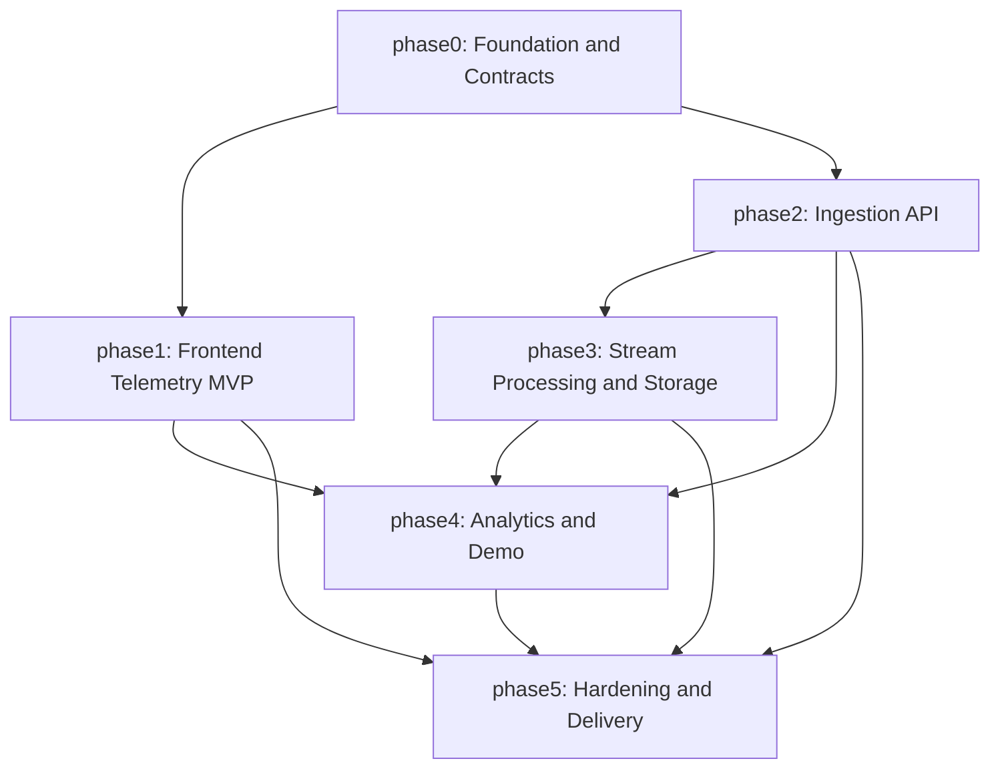

# Phase Index

## 1. Mục đích

Thư mục `documents/phases/` mô tả lộ trình triển khai cho hệ thống **Real-time Mouse Tracking Pipeline**. Mỗi phase là một mốc tích hợp có thể kiểm tra, không chỉ là một nhóm task rời rạc.

Nguồn kiến trúc chính:

- [Aim Trainer App Architecture](../aim_trainer_app_architecture.md)
- [Agent Development Protocol](../agents/AGENTS.md)
- [Commit Rules](../agents/commit_rules.md)

Tài liệu phase không thay thế task file. Khi triển khai code, task cụ thể vẫn phải dùng template tại [documents/templates/task.md](../templates/task.md) và được đặt dưới `documents/phases/<phase>/task<sequence>-<short-name>.md`.

---

## 2. Quy ước tài liệu

| Loại tài liệu | Vị trí | Vai trò |
|---|---|---|
| Phase overview | `documents/phases/<phase>/README.md` | Mục tiêu, phạm vi, dependency và gate của phase |
| Plan | `documents/plans/<phase>/planNNN-<short-name>.md` | Kế hoạch triển khai chi tiết thuộc một phase |
| Decision record | `documents/decisions/decisionNNN-<short-name>.md` | Quyết định kiến trúc hoặc hiệu năng cần giữ ổn định |
| Task file | `documents/phases/<phase>/taskNNN-<short-name>.md` | Nhật ký thực thi một task cụ thể |

Một plan phải trỏ về phase sở hữu nó. Nếu plan cần dựa trên một quyết định kiến trúc, plan phải liên kết tới decision record tương ứng trong `documents/decisions/`.

---

## 3. Ràng buộc kế thừa từ kiến trúc

Các phase đều phải giữ những ràng buộc sau:

- Aim Trainer là nguồn sinh dữ liệu có ngữ cảnh rõ ràng, không phải game phức tạp độc lập.
- `mousemove` và `click` phải được thu thập theo session.
- Không gửi một HTTP request cho từng event.
- Event được gom batch trước khi gửi sang FastAPI.
- `mousemove` không được làm React re-render trên từng event.
- Tọa độ phải gắn với canvas, có thể bổ sung tọa độ chuẩn hóa.
- Kết thúc phiên phải flush buffer còn lại trước khi xem là hoàn tất.
- Pipeline phải chứng minh được đường đi: Frontend -> FastAPI -> Kafka -> Spark -> MinIO / InfluxDB -> Grafana.

---

## 4. Phase Map

| Phase | Tên | Mục tiêu chính | Depends on | Plans | Decisions chính |
|---|---|---|---|---|---|
| [phase0](phase0/README.md) | Foundation and Contracts | Chốt cấu trúc repo, schema, API contract và nguyên tắc tài liệu | None | [plan001](../plans/phase0/plan001-repository-and-doc-governance.md), [plan002](../plans/phase0/plan002-contract-first-schema-and-api.md) | [DEC-001](../decisions/decision001-canvas-relative-telemetry-schema.md), [DEC-004](../decisions/decision004-http-ingestion-before-kafka.md), [DEC-010](../decisions/decision010-local-first-docker-compose-stack.md), [DEC-011](../decisions/decision011-vite-react-shadcn-frontend-stack.md), [DEC-012](../decisions/decision012-uv-managed-python-api-environment.md) |
| [phase1](phase1/README.md) | Frontend Telemetry MVP | Xây Aim Trainer playable và collector/buffer/sender hiệu năng tốt | phase0 | [plan001](../plans/phase1/plan001-frontend-gameplay-shell.md), [plan002](../plans/phase1/plan002-telemetry-collector-buffer-sender.md), [plan003](../plans/phase1/plan003-session-result-and-client-analytics.md) | [DEC-001](../decisions/decision001-canvas-relative-telemetry-schema.md), [DEC-002](../decisions/decision002-client-side-batching-and-sampling.md), [DEC-003](../decisions/decision003-react-state-vs-ref-boundary.md), [DEC-007](../decisions/decision007-memory-bounded-retry-policy.md), [DEC-011](../decisions/decision011-vite-react-shadcn-frontend-stack.md) |
| [phase2](phase2/README.md) | Ingestion API | Nhận session và batch telemetry ổn định, validate schema, đẩy Kafka | phase0, phase1 contract | [plan001](../plans/phase2/plan001-fastapi-ingestion-contract.md), [plan002](../plans/phase2/plan002-backpressure-and-idempotent-ingestion.md) | [DEC-001](../decisions/decision001-canvas-relative-telemetry-schema.md), [DEC-004](../decisions/decision004-http-ingestion-before-kafka.md), [DEC-005](../decisions/decision005-kafka-topic-layout-and-event-keys.md), [DEC-007](../decisions/decision007-memory-bounded-retry-policy.md), [DEC-012](../decisions/decision012-uv-managed-python-api-environment.md), [DEC-013](../decisions/decision013-fastapi-performance-oriented-api-stack.md) |
| [phase3](phase3/README.md) | Stream Processing and Storage | Kafka topics, Spark Structured Streaming, raw Parquet và time-series metrics | phase0, phase2 | [plan001](../plans/phase3/plan001-kafka-topics-and-local-infrastructure.md), [plan002](../plans/phase3/plan002-spark-streaming-to-minio-influxdb.md) | [DEC-005](../decisions/decision005-kafka-topic-layout-and-event-keys.md), [DEC-006](../decisions/decision006-raw-parquet-and-timeseries-metrics.md), [DEC-009](../decisions/decision009-session-analytics-event-time-watermark.md) |
| [phase4](phase4/README.md) | Analytics and Demo | Dashboard, session analytics, demo scenarios và load generator | phase1, phase2, phase3 | [plan001](../plans/phase4/plan001-dashboard-session-analytics.md), [plan002](../plans/phase4/plan002-demo-scenarios-and-load-generation.md) | [DEC-006](../decisions/decision006-raw-parquet-and-timeseries-metrics.md), [DEC-008](../decisions/decision008-load-generator-separated-from-player-app.md), [DEC-009](../decisions/decision009-session-analytics-event-time-watermark.md) |
| [phase5](phase5/README.md) | Hardening and Delivery | Performance validation, observability, runbook, packaging và báo cáo cuối | phase1, phase2, phase3, phase4 | [plan001](../plans/phase5/plan001-performance-validation-and-observability.md), [plan002](../plans/phase5/plan002-packaging-runbooks-and-final-report.md) | [DEC-002](../decisions/decision002-client-side-batching-and-sampling.md), [DEC-007](../decisions/decision007-memory-bounded-retry-policy.md), [DEC-010](../decisions/decision010-local-first-docker-compose-stack.md) |

---

## 5. Dependency Graph

---

## 6. Completion Rules

Một phase chỉ được xem là hoàn thành khi:

1. Tất cả plan bắt buộc của phase đã có task triển khai tương ứng hoặc được ghi rõ là không triển khai trong phạm vi MVP.
2. Decision records liên quan đã ở trạng thái `DECIDED` hoặc có follow-up cụ thể nếu chưa chốt.
3. Các contract public như schema, API endpoint, Kafka topic hoặc storage layout đã được document.
4. Validation phù hợp đã được chạy hoặc được ghi rõ là chưa chạy vì chưa có code.
5. Phase sau có thể bắt đầu mà không phải đoán dependency.
